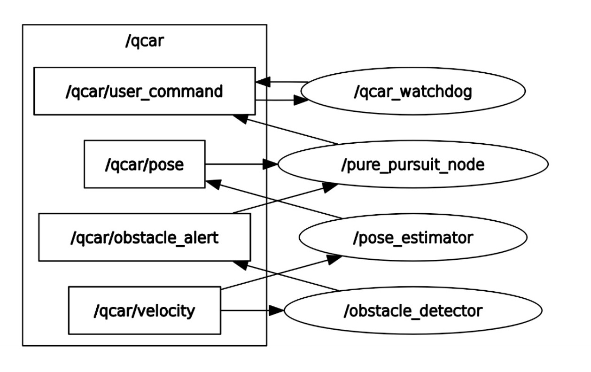
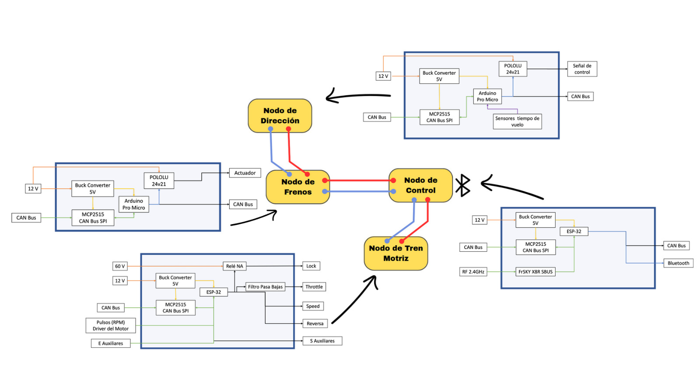
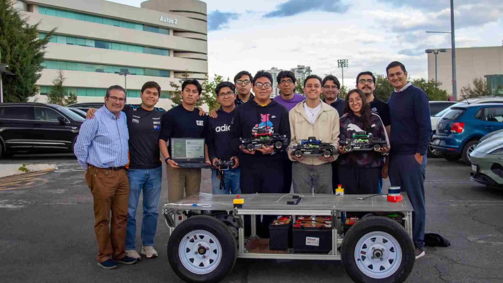

# Smart Mobility 2025--Autonomous Driving in QCar1 and AMR1 implementing ROS2

This repository contains the complete development workspace used to implement autonomous mobility solutions on two platforms (Quanser QCar1 and AMR1) as part of the Smart Mobility Concentration at Tecnológico de Monterrey, Campus Puebla (Aug–Dec 2025).

Quanser QCar 1 (LiDAR, IMU, Encoders, Pure Pursuit controller)
AMR1 Custom Vehicle (ESP32-based sensors, IMU + encoders, CAN-based, Pure Pursuit controller)

The system includes:

Sensor acquisition (IMU, LiDAR, Encoders)

Real-time filtering (Kalman)

Autonomous navigation (Pure Pursuit, Ackermann model)

Hardware/firmware 


## Workspace Structure
```
smart_mobility_2025/
│
├── Data/                                   # Datasets: trajectories, CSV logs, experiment metrics
│   ├── amr_pure_pursuit/                   # AMR Pure Pursuit logs (plots + CSV)
│   ├── qcar_expo_pure_pursuit/             # QCar results for the Expo demonstration
│   └── qcar_pure_pursuit/                  # QCar Pure Pursuit experiments
│
├── hardware_instrumentation/               # ESP32 / Arduino firmware
│   ├── encoders/
│   │   ├── contador_encoder_amh19.ino
│   │   └── encoder_amr_amh19_pyserial.ino
│   │
│   ├── imu/
│   │   ├── imu_bo055_esp32.ino
│   │   └── imu_bo055_esp32_ros2.ino
│   │
│   └── imu_encoder_amr_pyserial_amh19.ino  # Combined IMU + Encoder firmware
│
├── src/                                    # ROS2 workspace packages
│   ├── sensores_kalman/                    # Main ROS2 package (Kalman filters, pose, Pure Pursuit)
│   │   ├── resource/
│   │   ├── sensores_kalman/
│   │   │   ├── amr_encoder_amh19.py
│   │   │   ├── amr_imu_encoder.py
│   │   │   ├── amr_pure_pursuit.py
│   │   │   ├── lidar_kalman_node_amh19.py
│   │   │   ├── pose_ekf_amr.py
│   │   │   ├── pose_ekf_qcar_2.py
│   │   │   ├── pose_final_qcar.py
│   │   │   ├── qcar_lidar_alert_2.py
│   │   │   ├── qcar_pure_pursuit.py
│   │   │   ├── qcar_watchdog_node.py
│   │   │   └── trayectoria_grabar_csv_node.py
│   │   │
│   │   ├── test/
│   │   ├── package.xml
│   │   ├── setup.cfg
│   │   └── setup.py
│   │
│   └── sm_interfaces/                       # Custom ROS2 interfaces (.msg)
│
├── team_amr/                                # Submodule: AMR team workspace firmware 
│
├── LICENSE
├── README.md
└── .gitignore
```


## System Launch

This workspace includes the full autonomous driving stack for the Quanser QCar1 and the AMR1 platform.  
Below is the recommended launch sequence for running the QCar on real hardware.

---

### **Launch QCar**

Start the connection with the QCar (you must be connected to the same Network).

```bash
ssh -X nvidia@192.168.1.X
```
To launch the QCar Superuser permissions are needed.

```bash
sudo -s
```

Starts all hardware interfaces (IMU, LiDAR, encoder, Steering control).

```bash
ros2 launch qcar qcar_launch_sm_aim.py
```

---

## Autonomous Stack Nodes for QCar1

### **Run QCar Pose Estimator**
Integrates IMU + encoder commands to estimate pose \[x, y, θ\].

```bash
ros2 run sensores_kalman pose_ekf_qcar_2
```

### **Run Obstacle Detector (LiDAR-based)**
Publishes `/qcar/obstacle_alert` when obstacles appear in the frontal cone.

```bash
ros2 run sensores_kalman qcar_lidar_alert_2
```

### **Run Watchdog Node**
Ensures a STOP command is sent if `/qcar/user_command` stops publishing.

```bash
ros2 run sensores_kalman qcar_watchdog_node
```

---

## **Pure Pursuit Controller (Autonomous Driving)**

### **Run Pure Pursuit controller**
This node computes the steering command based on the loaded trajectory and publishes automatic driving commands,
creates a circular trajectory if none waypoints.csv are loaded.

```bash
ros2 run sensores_kalman pure_pursuit_node
```
ROS2 Command to load a recorded trajectory.
```bash
ros2 run sensores_kalman pure_pursuit_node --ros-args -p path_csv:=/home/user/route/name_trajectory.csv
```

---

## Optional Individual Sensor Nodes

Run only if you want to debug/visualize each sensor independently:


### LiDAR visualization 
```bash
ros2 run sensores_kalman lidar_kalman_node_amh19
```

### Record Trajectories to CSV
```bash
ros2 run sensores_kalman trayectoria_grabar_csv_node
```
and command node has to run for Qcar trayectories
```bash
ros2 run qcar command
```
### **Launch AMR1**

Start the connection with the AMR1 (you must be connected to the same Network).

```bash
ssh -X traxxas@10.42.0.XX
```
Starts all hardware interface (runs AMR1 Odometry), integrates IMU + encoder data and publishes in a custom interface \[pulses, velocity, distance, acceleration in X, Y, Z and roll, pitch, yaw\].

```bash
ros2 run sensores_kalman amr_imu_encoder
```
## Autonomous Stack Nodes for AMR1

### **Run AMR1 Pose Estimator**
Integrates IMU + encoder commands to estimate pose \[x, y, θ\].

```bash
ros2 run sensores_kalman pose_ekf_amr
```

## **Pure Pursuit Controller (Autonomous Driving)**

### **Run Pure Pursuit controller**
This node computes the steering command based on the loaded trajectory and publishes automatic driving commands,
creates a sinewave trajectory if none waypoints.csv are loaded.

```bash
ros2 run sensores_kalman amr_pure_pursuit
```
ROS2 Command to load a recorded trajectory.
```bash
ros2 run sensores_kalman amr_pure_pursuit --ros-args -p path_csv:=/home/user/route/name_trajectory.csv
```

---

---

# QCar1 Node Description Summary

| Node | Description | Subscribes | Publishes |
|------|-------------|------------|-----------|
| **imu_external** | Node running in QCar1 from IMU BNO055 | Gets data via Pyserial from ESP32 | `/imu/accel_raw`, `/imu/data` |
| **pose_ekf_qcar_2** | Pose estimation from IMU + Encoder | `/qcar/velocity`, `/imu/accel_raw` | `/qcar/pose`|
| **qcar_lidar_alert_2** | Frontal LiDAR obstacle detection | `/qcar/scan`| `/qcar/obstacle_alert` |
| **qcar_pure_pursuit** | Pure Pursuit controller for autonomous driving | `/qcar/pose`, `/qcar/obstacle_alert`| `/qcar/user_command` |
| **qcar_watchdog_node** | Safety node: forces STOP if command frequency drops | `/qcar/user_command` | `/qcar/user_command` |
| **trayectoria_grabar_csv_node** | Node to record waypoints and plot desired trajectory | `/qcar/pose` | None |
| **lidar_kalman_node_amh19** | Qcar1  LiDAR + filtered visualization | `/qcar/scan` | None |



# AMR1 Node Description Summary

| Node | Description | Subscribes | Publishes |
|------|-------------|------------|-----------|
| **amr_imu_encoder** | Odometry estimation from IMU + Encoder | Gets data via Pyserial from ESP32 |`/amr/odom`|
| **pose_ekf_amr** | Pose estimation from IMU + Encoder \[x, y, θ\] | `/amr/odom`| `/amr/pose` |
| **amr_pure_pursuit** | Pure Pursuit controller for autonomous driving | `/amr/pose`| None |
| **trayectoria_grabar_csv_node** | Node to record waypoints and plot desired trajectory | `/amr/pose` | Writes data via Pyserial to ESP32 and CAN Bus  |



---
# Development & Execution Environment

This project was developed and tested using a combination of high-performance laptops and embedded hardware to ensure reliable real-time autonomy for both QCar1 and AMR1 platforms.

### **Main Development Machine**

All ROS2 nodes, Pure Pursuit controllers and integration pipelines were developed and executed on:
### *ASUS ROG Strix G16
CPU: Intel Core i9
GPU: NVIDIA RTX 4060
RAM: 32 GB
Storage: 1 TB NVMe SSD
OS: Ubuntu 22.04 LTS
Middleware: ROS2 Humble 

This machine was used to run:
All ROS 2 launch files
Real-time QCar teleoperation
Pure Pursuit & control nodes
Sensor fusion (IMU, LiDAR, encoder)

### **Supporting Development Laptop**

A secondary system was also used for testing, debugging and remote execution:

### *ASUS TUF Gaming (Ryzen)

CPU: AMD Ryzen Series
GPU: NVIDIA RTX series
RAM: 16 GB
OS (host): Windows 11
WSL2 Distribution: Ubuntu 22.04 LTS

Used for Pure Pursuit and control nodes
Dataset generation, visualization, and analysis

### **Embedded Computing for AMR1**

To support autonomous navigation and sensor acquisition for the AMR1 platform, a dedicated embedded system was used:

### *NVIDIA Jetson Orin Nano Developer Kit

ARM64 architecture
Hosted ROS 2 nodes for IMU, encoders and Pure Pursuit
Executed firmware communication with ESP32 microcontrollers
Used as the on-board brain for:
Low-latency sensor acquisition
Hardware-level filtering
Real-time control loops
CAN / serial integration


### **Microcontroller Layer (ESP32)**

A set of ESP32 microcontrollers was used for:

Encoder acquisition
IMU acquisition
Serial and CAN communication
Integrated hardware instrumentation
Firmware was placed under:
hardware_instrumentation/

---
## A message for future innovators

This section is dedicated to future generations of students, researchers, and developers who choose to continue building upon this project.
Below you may find personal messages, lessons learned, and advice from each team member to help guide the next stage of innovation.

### **Abraham**
I want to tell you that whatever reason you decided to continue this project, hold on to that purpose throughout the whole process. As a personal advice: start by understanding what needs to be done and how you can achieve it. Study, learn and ask all the questions you need. Once you truly understand the problem, you can begin solving it and debugging with confidence. Enjoy the process, enjoy the challenges, have a great time with your team and never lose sight of your objective. This project will make you a better engineer. Yes, there will be struggle, but every hour you invest is worth it. And when you feel like you've lost hope and nothing works, take a moment to reflect on how you started, who you were back then, and how much you’ve grown throughout the challenge. Appreciate that journey, enjoy it!.--AMH19

### **Mariana**

If you are about to start this project, I want to tell you something that I would have liked to hear: don't get frustrated when the simulation fails, when the real car doesn't follow the trajectory, or when the controllers seem to break down for no reason. It's part of the process, keep trying. Every error, every graph, and every failed attempt brings you closer to a deeper understanding of the system, so document everything. Before they ask you to, be clear about what you are doing and why. There comes a moment when everything starts to make sense: the curves, the parameters, the delays, the odometry. Trust your judgment, measure, experiment, try again. This project has a steep learning curve, but it becomes very rewarding. You too can achieve it and improve on what we did.

### **Iván**
For all the students who wish to continue with the project, I want you to keep in mind that it is not something simple; on the contrary, it is an ambitious and challenging project that pushes you to bring out the best in yourself at every moment. I know that at the beginning you may feel disoriented or lost, but that is part of the learning curve. It is essential that you research, ask questions, and learn as much as you can, and above all, that you understand what is done in each process.
It is a challenging project from every perspective; resilience, adaptability, and continuous learning are key elements for developing it. Without a doubt, it is a project that helps you grow as a future engineer: you will have to develop several skills throughout the process in order to work effectively with others.
In the end, you will realize that all the work and effort were worth it, because the reward is unmatched. I want you to enjoy the process and reflect on everything you learned—where you started and how you finished.

### **Franco**
For those taking over this AMR project, please note these essential points:
* Patience is Key: The system can become unstable or fail with prolonged use.
* Safety First (48V+): Exercise extreme caution; the system handles voltages exceeding 48V.
* Wiring Caution: Be extremely careful with the cables when changing or adding components.
* Testing Safety: Always use slow mode for physical tests to prevent damage from collisions.
* Support: Enjoy the project!

### **Yonathan**
Regardless of your major or background, this project will help you develop real engineering skills if you are willing to try. Don’t be afraid to dive in.

### **Pedro**
The development of the project required several hours of hardwork and technical skills, which are worth the moment you can appreciate the AMR vehícle during an autonomous dynamic driving task. At the actual moment, there are still limitations for autonomous driving development, one of which optimization process is highly recommended after reaching the development of an standarized process on both scale platforms and real ones. Since the opportunity area is related to optimal energy/processing applications, the next step is likely to the implementation of more robust controlers and coms, while using an meta-heuristics algorithm in order to reduce processing time for scale platforms on driving tasks.

Therefore, according to statistical results, the actual project remains under the acceptable quality boundaries if applied as an OEM driving development, which means that despite limitations found during the project development, our strategies demonstrated solid results on the ongoing I+D phase, which (for nxt gen developers) it is expected to evolve and deal with real time circumstances on the driving dynamic (such as obstacle evasion, and environment processing), and given the results, its likely to be reached for the next oncoming developers


---

# Smart Mobility Concentration Team 2025 — Professors & QCar1 / AMR1 Platforms

Below is the 2025 Smart Mobility Concentration team together with the professors and collaborators who supported the development of QCar1 and AMR1 autonomous driving systems.

From left to right in the photo:
PhD. Hugo Gonzalez-Hernandez, Pedro, Alfonso, Franco, Yonathan, Abraham, PhD. Daniel Sosa-Ceron, Iván, Alexander, Mariana, MSc. Julio, PhD. Jorge Reyes.




## Team Roles & Technical Contributions

Project Leadership & Autonomous Systems

Abraham Moro Hernández – |Project Leader|
Responsible for the complete integration of autonomous mobility in QCar1 and AMR1, including ROS2 architecture, sensor fusion pipelines, calibration pipelines, hardware instrumentation and integration and ESP32 firmware.

Iván Valdez del Toro – |Co-Leader|
Coordinated ROS2 nodes, hardware integration, software architecture, and Pure Pursuit controllers.

Mariana Manjarrez Lima – |Autonomous Systems Engineer|
Worked on ROS2 nodes, calibration pipelines, control tuning, and testing of both QCar1 and AMR1.

AMR1 Rehabilitation & Embedded Control Team

Franco Abraham Díez – |Embedded Systems / CANBus Lead|
Rehabilitated AMR1 wiring, designed CAN bus communication, actuator control, mechanical design and manufacturing.

Yonathan Romero Amador – |Motor Control & Sensor Integration|

Assisted in AMR1 instrumentation, PCB Design for AMR1 systems and and microcontroller integration.

Pedro García Millán – |Documentation|
Supported documentation of AMR1.


## Research Support

MSc. Jesús Orlando (PhD Student)
Advised on state estimation, Kalman filtering, and control strategies.

MSc. Julio de la Trinidad (PhD Student)
Advised on state estimation, Kalman filtering, and control strategies.

Alexander (PhD Student)
Provided support for system modeling, and AMR1 intrumentation.

Alfonso (Robotics Student)
Collaborated in testing sessions.


## Faculty Advisors

The project was guided by the professors of the Smart Mobility Concentration:

PhD. Hugo Gonzalez-Hernandez – Robotics & Control

PhD. Daniel Sosa-Ceron – Robotics & Control

PhD. Jorge Reyes – Autonomous Vehicles Platforms

Their mentorship shaped the engineering criteria, methodology, and technical rigor of the project.

---
# Authors

Abraham Moro-Hernandez
Tecnologico de Monterrey – Campus Puebla
--Smart Mobility Concentration-- 
LinkedIn www.linkedin.com/in/abraham-moro-hernandez-amh19

Mariana Manjarrez Lima
Tecnologico de Monterrey – Campus Puebla
--Smart Mobility Concentration-- 
E-mail: marianamanjarrezlima@gmail.com

Iván Valdéz del Toro
Tecnologico de Monterrey – Campus Puebla
--Smart Mobility Concentration-- 
LinkedIn http://www.linkedin.com/in/ivan-valdez-del-toro

Franco Abraham Díez
Tecnologico de Monterrey – Campus Puebla
--Smart Mobility Concentration-- 
LinkedIn https://www.linkedin.com/in/franco-abraham-diez-259273315?lipi=urn%3Ali%3Apage%3Ad_flagship3_profile_view_base_contact_details%3Begf%2FhezURfG7bdZxPl1opA%3D%3D

Yonathan Romero Amador
Tecnologico de Monterrey – Campus Puebla
--Smart Mobility Concentration-- 
E-mail: romeroamadoryonathan@gmail.com

Pedro García Millán
Tecnologico de Monterrey – Campus Puebla
--Smart Mobility Concentration-- 
LinkedIn http://www.linkedin.com/in/pedrogarciaoooo


## License

Distributed under the Apache 2.0 License, fully compatible with the ROS 2 ecosystem.

This project is based on the Quanser QCar1 and AMR1 ROS 2 environment and the pal.products.qcar libraries.
Developed as part of the Smart Mobility course (MR3004C) at Tecnológico de Monterrey.


